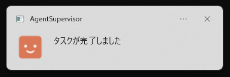
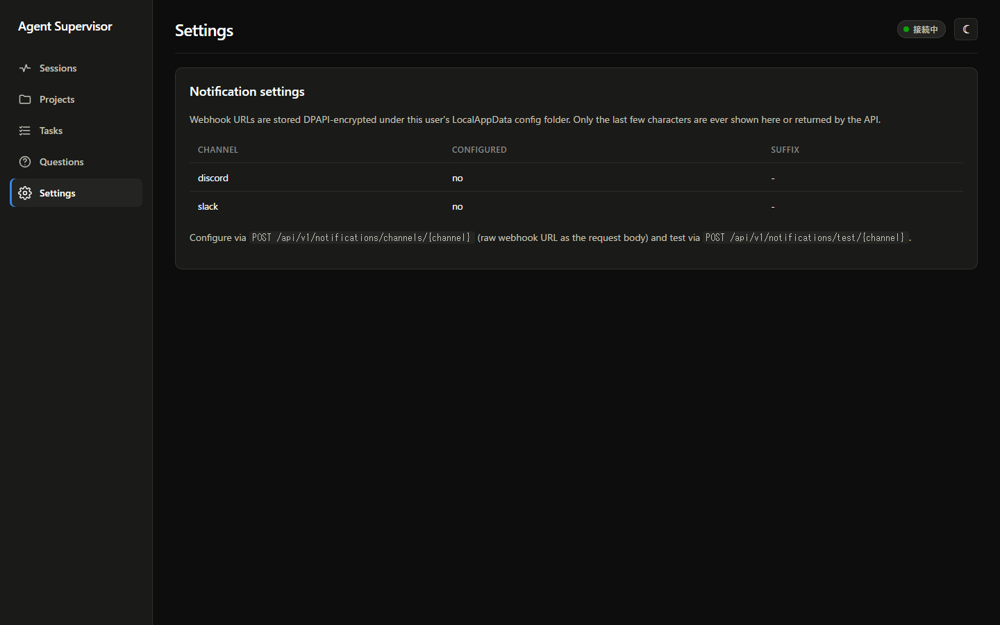
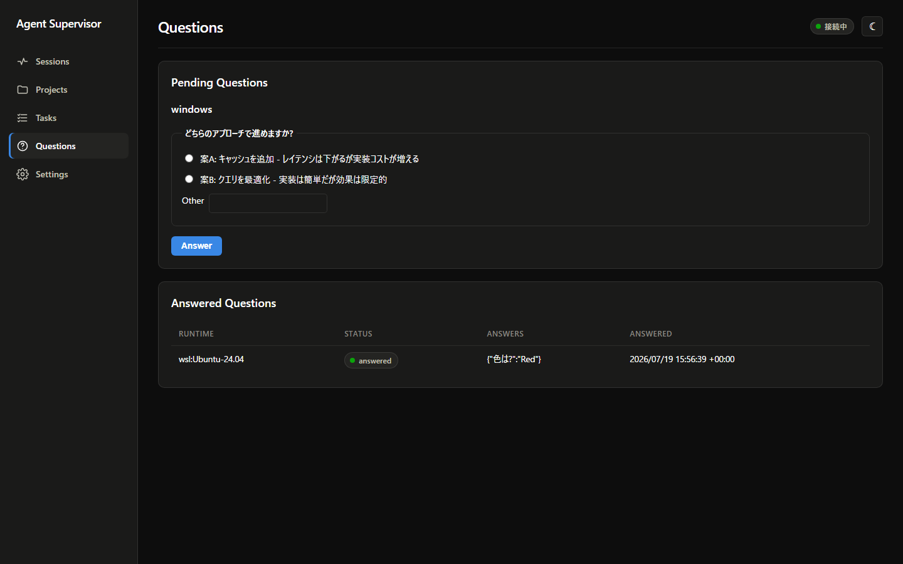
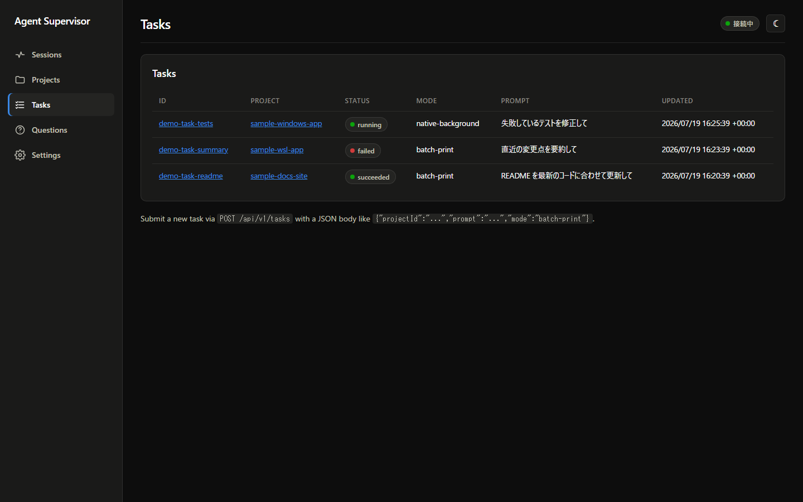

# Agent Supervisor

[](https://github.com/kenkiti/claude-agent-supervisor/actions/workflows/release.yml)
[](https://github.com/kenkiti/claude-agent-supervisor/releases/latest)
[](LICENSE)
[](https://github.com/kenkiti/claude-agent-supervisor)
[](https://dotnet.microsoft.com/)

**PCの前にいなくても、Claude Codeからの「許可待ち・質問・完了・失敗」に気づける**、Windows用の常駐通知ツールです。

Claude Codeに長時間の作業を任せると、途中でツール実行の許可待ちや`AskUserQuestion`の質問で止まったり、気づかないうちに失敗して終わっていたりします。Agent Supervisorは、WindowsとWSL2の両方のClaude Codeセッションを常時監視し、そうした「人の対応が必要な瞬間」を**Windowsトースト通知とSlack / Discordへ即座に届けます**。



1つの実行ファイル（`AgentSupervisor.exe`）を起動するだけで使えます。Node.js・Python・Dockerなど追加のランタイムは不要です。

---

## 届く通知

以下の状態変化を検知して、通常は数秒〜30秒未満で通知します。通知はイベント名だけでなく、**Claude Codeが出力したメッセージ本文**（質問文や許可を求めている内容）を含みます。

| 通知 | 意味 |
|---|---|
| 許可待ち | Claude Codeがツールの実行許可を待っている |
| 入力待ち | Claude Codeがユーザーの入力を待っている |
| 質問が回答待ち | `AskUserQuestion`による質問が届いている |
| タスクが完了しました | 投入したタスクが正常終了した |
| バックグラウンドセッションが失敗しました | `claude --bg`セッションが異常終了した |
| 認証エラー | Claude CLIのログインが切れている |
| ランタイム接続不可 | WSLディストロ名や`claude`コマンドの設定に問題がある |
| 自動リトライが上限に達しました / 自動復旧を停止しました / 日次予算の上限を超過しました | タスクの自動復旧が人の判断を必要としている |

### Windowsトースト通知

タスクトレイに常駐し、アプリアイコン付きのトースト通知を表示します。severityに応じて通知音も鳴るため、別の作業をしていても気づけます。

### Slack / Discord連携

外出中・離席中はSlackやDiscordで受け取れます。Webhook URLを設定するだけで、すべての通知が自動的に転送されます。

通知メッセージの例:

```text
[warning] 入力待ち: Claude Codeがユーザーの入力を待っています (input-needed)
Claude needs your permission to use Bash
```

設定はダッシュボードのSettings画面から行えます。



APIからも設定できます。

```powershell
curl -X POST http://127.0.0.1:8700/api/v1/notifications/channels/discord `
  -H "Content-Type: text/plain" --data-raw "https://discord.com/api/webhooks/...."

curl -X POST http://127.0.0.1:8700/api/v1/notifications/channels/slack `
  -H "Content-Type: text/plain" --data-raw "https://hooks.slack.com/services/...."

# 設定確認用のテスト送信
curl -X POST http://127.0.0.1:8700/api/v1/notifications/test/discord
```

Webhook URLはWindowsのDPAPI（このWindowsアカウントでのみ復号可能な暗号化）で保存され、画面やAPIレスポンスには末尾数文字のマスク表示以外、平文では一切表示されません。

なお、「Slack/DiscordからClaudeへ任意のコマンドを送り込む」ためのツールではありません。あくまで**見守り・通知**が目的です（通知は一方向です）。

---

## 動作環境

- Windows 11（管理者権限は不要です）
- Windows版のClaude Code（ネイティブインストール済みであること）
- WSL2を使う場合は、WSL2内にもClaude Codeがインストール・ログイン済みであること

---

## インストールと初回起動

1. [Releases](https://github.com/kenkiti/claude-agent-supervisor/releases/latest)から`AgentSupervisor.exe`をダウンロードし、任意の場所に置いて起動します。
2. 初回起動時にウィザードが動き、以下を自動で行います。
   - `%LOCALAPPDATA%\AgentSupervisor\`配下への本体配置
   - WindowsとWSLのClaude Code検出
   - 監視用Hookのインストール（`~/.claude/settings.json`への安全なマージ。既存設定は壊しません）
3. 起動後は通知領域（タスクトレイ）に常駐します。この時点で通知は有効です。
4. 二重起動はできません。既に起動している場合は、既存のウィンドウにフォーカスが移ります。

WSL2のディストリビューション名が既定の`Ubuntu`と異なる場合は、環境変数`AGENTSUPERVISOR_WSL_DISTRO`に実際のディストロ名（`wsl -l -v`で確認できます）を設定してから起動してください。

```powershell
$env:AGENTSUPERVISOR_WSL_DISTRO = "Ubuntu-24.04"
.\AgentSupervisor.exe
```

Control Plane（このアプリ自体）が停止していても、Claude Code本体の作業や既存のローカル権限設定には一切影響しません。

---

## おまけ: Webダッシュボード

通知だけでなく、`http://127.0.0.1:8700/`のローカルWebダッシュボードから状況の確認と操作もできます（SignalRによるライブ更新・ライト/ダーク切り替え対応）。

- **Sessions（`/`）** — WindowsとWSLの全Claude Codeセッションを1つの表で確認。「承認待ち」「エラーで停止」などの状態が一覧できます。
- **Questions（`/Questions`）** — Claude Codeが`AskUserQuestion`で質問してきたとき、ターミナルへ戻らずこの画面から回答できます。回答は数秒以内に元のセッションへ反映され、Claudeはそのまま作業を継続します（未回答のまま既定25分でタイムアウト）。

  

- **Projects / Tasks（`/Projects`, `/Tasks`）** — 定型タスクをプロジェクトへ投入し、実行履歴・失敗理由・自動リトライの経緯を確認できます。一時的な失敗（レート制限やネットワークエラー）だけを上限付きで自動リトライし、人の判断が必要な失敗は自動リトライしません。

  

タスク投入・プロジェクト登録のAPI例:

```powershell
# ランタイムとプロジェクトを登録
curl -X POST http://127.0.0.1:8700/api/v1/runtimes -H "Content-Type: application/json" `
  -d '{"id":"windows","type":"windows","distribution":null,"claudeCommand":"claude"}'

curl -X POST http://127.0.0.1:8700/api/v1/projects -H "Content-Type: application/json" `
  -d '{"id":"my-app","runtimeId":"windows","cwd":"C:/Projects/my-app","maxParallel":1,"defaultMode":"native-background"}'

# タスクを投入
curl -X POST http://127.0.0.1:8700/api/v1/tasks -H "Content-Type: application/json" `
  -d '{"projectId":"my-app","prompt":"READMEを最新のコードに合わせて更新して","mode":"native-background","timeoutSeconds":600}'
```

`mode`は`native-background`（`claude --bg`相当。長時間の作業向け）と`batch-print`（`claude -p`相当。`maxTurns`/`maxBudgetUsd`で上限を強制できる定型タスク向け）の2種類です。

---

## コマンドライン

```text
AgentSupervisor.exe                 通常起動（通知 + 常駐 + ダッシュボード）
AgentSupervisor.exe install         監視用Hookをインストール
AgentSupervisor.exe install --dry-run   実際には書き込まず、変更内容だけ確認
AgentSupervisor.exe uninstall       Hookと既存の自動起動登録を削除
AgentSupervisor.exe update <exeのパス>  差し替え用exeで自己更新(失敗時は自動ロールバック)
AgentSupervisor.exe restore-db <バックアップファイル>  DBを指定バックアップへ復元
```

---

## アンインストール

```text
AgentSupervisor.exe uninstall
```

- Windows／WSL両方のHookをClaude設定から削除します。
- Windowsログオン時の自動起動登録を削除します。
- 本体・データベース・ログは残ります（手動で`%LOCALAPPDATA%\AgentSupervisor\`を削除してください）。

---

## トラブルシューティング

- **通知が届かない**: タスクトレイにアイコンが出ているか（常駐しているか）を確認してください。Slack/Discordへ届かない場合は、Settings画面のテスト送信で疎通を確認できます。
- **通知領域にアイコンが出ない/起動しない**: 既に別のインスタンスが起動していないか確認してください（二重起動は自動的に既存ウィンドウへフォーカスするだけで、新しいプロセスは終了します）。
- **WSL側のセッションが監視されない**: `AGENTSUPERVISOR_WSL_DISTRO`が実際のディストロ名と一致しているか確認してください（`wsl -l -v`で確認）。WSL側にもClaude Codeがインストール・ログイン済みである必要があります。
- **`AskUserQuestion`に回答したのに反映されない**: 元のセッションが`claude --bg`のバックグラウンドセッションであることを確認してください。反映は最大でも数秒ですが、25分経過するとタイムアウトし、`claude attach <id>`での手動対応が必要になります。

---

## ソースからのビルド

.NET 10 SDKが必要です。

```powershell
dotnet build AgentSupervisor.slnx
dotnet test AgentSupervisor.slnx --configuration Release
./scripts/publish-win-x64.ps1   # self-contained single-file exe を生成
```

---

## ライセンス

[MIT License](LICENSE)
